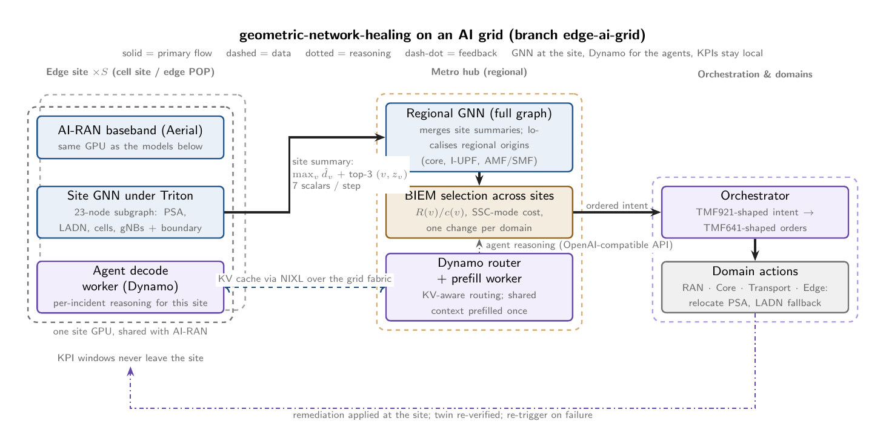

# Geometric Network Healing, branch `edge-ai-grid`

**Geometric deep learning for business-aware, self-healing telecom networks, deployed on an NVIDIA AI grid: PDU session anchors and Local Area Data Networks in the twin, per-site inference at the edge, Dynamo for the agents around the model.**

This branch extends [`master`](https://github.com/dkypuros/geometric-network-healing) with the edge. Everything on master still holds; what is new is below, then the base system follows.



## What the edge changes

| | master | edge-ai-grid |
|---|---|---|
| Twin | cells, gNBs, routers, links, UPF/AMF/SMF, services | + per site a **PDU Session Anchor UPF** (`psa`) and a **Local Area Data Network** (`ladn`) with its own edge service, behind a regional **I-UPF**; every node has a site index |
| Faults | fiber, router, UPF, cell, AMF | + `psa_overload`, `ladn_dn_degrade` |
| Remediation | per type | + `psa_relocate_ssc_mode{3,2,1}_to_backup` (re-anchor at the next site's PSA), `iupf_reselect_n9_path`, `ladn_fallback_to_regional_dn` |
| Business cost | per type | **SSC mode** sets the cost of relocating an anchor: cheap for mode 3 (make-before-break), expensive for mode 1 (`--ssc-mode`) |
| Inference | one full graph | the **same model per site** on a 23-node subgraph, 7 scalars per step uplinked, regional merge; measured against full-graph inference (`make pipeline-edge`) |
| Serving | n/a | GNN under **Triton / TensorRT** on the site GPU shared with AI-RAN; **NVIDIA Dynamo** serves the LLM agents (disaggregated prefill at the hub, decode at the site, KV-aware routing, NIXL transfer) |

Docs: [docs/edge-ai-grid.md](docs/edge-ai-grid.md), [deploy/ai-grid/topology.yaml](deploy/ai-grid/topology.yaml), Chapter 12 of the monograph. The AI-grid placement and Dynamo serving are documented, not exercised here; the partition cost is measured.


---

# Base system (from master)

A telecom network is not a grid. It is a heterogeneous directed graph whose node labels carry no
information, whose faults propagate along typed dependency edges, and whose business value sits in
a few revenue-dense cells. This repository derives, from the geometric deep learning blueprint, the
learning system that:

- detects **silent degradation** with no alarm and no static KPI threshold,
- ranks the **root cause across RAN, Core and Transport** from one softmax over the whole graph,
- orders remediation by **revenue at risk under a resource budget**, so the *same fault gets a
  different response* depending on who it hurts,
- closes the loop through **TMF921-shaped intents and TMF641-shaped service orders**, verifies, and
  re-triggers.

Every numbered equation in the monograph maps to a module. Every claim is measured on a synthetic
digital twin with injected faults against calibrated graph-free baselines. One command reproduces
the table.


## The claim

The learning stack of a business-aware GNN-healing system is mathematics anyone can implement with
the topology and the KPI history. Symmetry group: node permutation. Operator class: relational
message passing with transposed relations. Fault model: directed diffusion on the causal graph.
Detection: a learned degradation field. Root cause: a learned inverse of the propagation operator.
Business priority: a one-line knapsack rule the operator can read. The operator's moat is the data,
not the model.

The monograph is the argument: **[docs/math/geometric-network-healing.pdf](docs/math/geometric-network-healing.pdf)** (this branch's build includes Chapter 12, the edge).

## Results

<!-- RESULTS:START -->
Twin: 74 nodes, 130 edges. Fault episodes: 32, nominal: 8. Runtime 643.8 s.

| metric | value |
|---|---|
| detection rate, GNN | 1.00 |
| detection rate, static threshold | 1.00 |
| detection rate, service-layer z-score (calibrated z=4.1 / textbook z=3) | 0.00 / 0.31 |
| detection rate, per-node z-score (calibrated z=8.0 / textbook z=3) | 0.00 / 1.00 |
| false alarms on 8 nominal episodes: GNN / threshold / service z cal. / service z=3 / node z cal. / node z=3 | 0 / 0 / 0 / 4 / 0 / 8 |
| pre-onset false alarms on 32 fault episodes: same order | 0 / 0 / 0 / 3 / 0 / 30 |
| mean detection delay after onset (steps): GNN / static threshold | 22.9 / 32.6 |
| mean detection delay after onset (steps): service z cal. / service z=3 / node z cal. / node z=3 | nan / 56.2 / nan / 9.6 |
| mean lead time of GNN vs static threshold (steps, where it fired) | 9.8 |
| mean lead time of GNN vs service z (calibrated / z=3) | nan / 32.0 |
| mean lead time of GNN vs per-node z (calibrated / z=3) | nan / -13.3 |
| healed within 3 verify-and-re-trigger cycles | 1.00 |
| mean healing cycles | 1.00 |
| root cause hit@1 | 1.00 |
| root cause hit@3 | 1.00 |
| degraded nodes at static-alarm time (war-room set, mean) | 13.9 |
| triage reduction @3 (share of the war-room set a top-3 RCA list skips) | 0.35 |
| revenue-weighted exposure, GNN-timed healing | 328.3 |
| revenue-weighted exposure, threshold-timed healing | 573.1 |

## By fault type

| fault | n | delay GNN | delay thr | delay service z=3 | hit@1 | hit@3 |
|---|---|---|---|---|---|---|
| amf_signaling_storm | 7 | 27.9 | 45.0 | 46.5 | 1.00 | 1.00 |
| fiber_degrade | 7 | 22.7 | 28.6 | 112.0 | 1.00 | 1.00 |
| router_congestion | 7 | 22.3 | 32.3 | 6.0 | 1.00 | 1.00 |
| sleeping_cell | 8 | 18.5 | 25.4 | 100.0 | 1.00 | 1.00 |
| upf_overload | 3 | 24.7 | 33.3 | 65.0 | 1.00 | 1.00 |

*(CPU, fixed seed; regenerate with `make pipeline`.)*
<!-- RESULTS:END -->

## Reproduce

```bash
git clone https://github.com/dkypuros/geometric-network-healing
cd geometric-network-healing
make setup        # uv venv, CPU PyTorch + PyTorch Geometric
make test         # 6 tests, incl. a numerical permutation-equivariance check on the model
make pipeline     # base twin: simulate -> baselines -> GNN -> detect -> RCA -> intent -> closed loop
make pipeline-edge  # edge twin with per-site vs full-graph inference (this branch's results table)
cat results/results.md
make pdf          # the monograph (needs a TeX distribution)
```

On a CUDA 12 Linux host, `make setup-nvidia` adds the RAPIDS stack (cuGraph-PyG, WholeGraph,
cuDF). See [docs/nvidia.md](docs/nvidia.md) for what each piece replaces and an honest note on
what is and is not tested here.

## Layout

```
src/gnn_healing/
  twin/           Ch. 2  heterogeneous directed graph, synthetic generator, revenue + profiles
  sim/            Ch. 4  fault catalogue, directed diffusion, episodes with ground truth
  baselines/      Ch. 5  static threshold, service-layer z-score trigger, per-node z-score
  gnn/            Ch. 3,5,6  HealingGNN (R-GCN over R u R^T), training, detection, RCA, NVIDIA adapter
  intent/         Ch. 7  revenue at risk, budgeted selection, TMF921-shaped intent
  orchestration/  Ch. 8  TMF641-shaped orders, mock orchestrator, closed loop, re-trigger
  evaluation/     Ch. 9  lead time, hit@k, triage reduction, exposure
  cli.py                 gnn-healing pipeline | twin | backend
docs/math/        the monograph (LaTeX, PDF committed)
docs/design/      TikZ diagrams: ai_grid (this branch), architecture, closed_loop (source + PNG)
deploy/ai-grid/   illustrative AI-grid deployment shape (roles, flows); not a tested config
docs/nvidia.md    the accelerated path
docs/industry-comparison.md   how this relates to a 2026 TM Forum Catalyst of the same shape
tests/            twin invariants, propagation stability, model equivariance, intent ordering
```

## What this is not

Not a real network: the twin and fault model are deliberately simple and are the first things to
replace with your topology and incident history. Not a standards implementation: intents and
orders follow TMF921/TMF641 field shapes so a real orchestrator can be swapped in, but no
conformance is claimed. Not a scale result: the NVIDIA path is documented and import-guarded, and
the public release was tested on a machine without a GPU.

## License

Apache-2.0.
