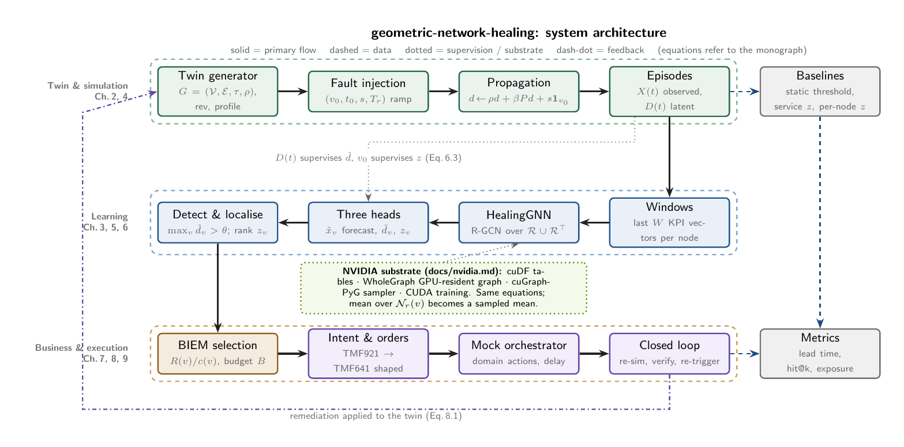
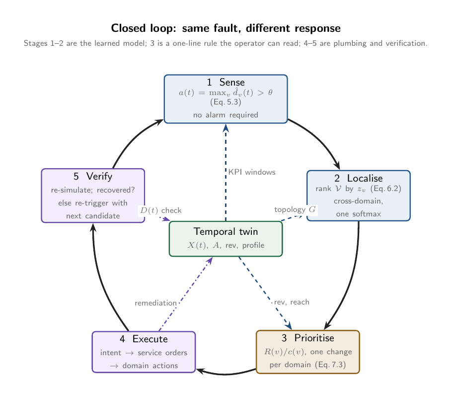

# Geometric Network Healing

**Geometric deep learning for business-aware, self-healing telecom networks. Open math, open code, NVIDIA-accelerated.**

A telecom network is not a grid. It is a heterogeneous directed graph whose node labels carry no
information, whose faults propagate along typed dependency edges, and whose business value sits in
a few revenue-dense cells. This repository derives, from the geometric deep learning blueprint, the
learning system that:

- detects **silent degradation** with no alarm and no static KPI threshold,
- ranks the **root cause across RAN, Core and Transport** from one softmax over the whole graph,
- orders remediation by **revenue at risk under a resource budget**, so the *same fault gets a
  different response* depending on who it hurts,
- closes the loop through **TMF921-shaped intents and TMF641-shaped service orders**, verifies, and
  re-triggers.

Every numbered equation in the monograph maps to a module. Every claim is measured on a synthetic
digital twin with injected faults against calibrated graph-free baselines. One command reproduces
the table.



## The claim

The learning stack of a business-aware GNN-healing system is mathematics anyone can implement with
the topology and the KPI history. Symmetry group: node permutation. Operator class: relational
message passing with transposed relations. Fault model: directed diffusion on the causal graph.
Detection: a learned degradation field. Root cause: a learned inverse of the propagation operator.
Business priority: a one-line knapsack rule the operator can read. The operator's moat is the data,
not the model.

The monograph is the argument: **[docs/math/geometric-network-healing.pdf](docs/math/geometric-network-healing.pdf)**.



## Results

<!-- RESULTS:START -->
<!-- RESULTS:END -->

## Reproduce

```bash
git clone https://github.com/dkypuros/geometric-network-healing
cd geometric-network-healing
make setup        # uv venv, CPU PyTorch + PyTorch Geometric
make test         # 6 tests, incl. a numerical permutation-equivariance check on the model
make pipeline     # twin -> simulate -> baselines -> GNN -> detect -> RCA -> intent -> closed loop
cat results/results.md
make pdf          # the monograph (needs a TeX distribution)
```

On a CUDA 12 Linux host, `make setup-nvidia` adds the RAPIDS stack (cuGraph-PyG, WholeGraph,
cuDF). See [docs/nvidia.md](docs/nvidia.md) for what each piece replaces and an honest note on
what is and is not tested here.

## Layout

```
src/gnn_healing/
  twin/           Ch. 2  heterogeneous directed graph, synthetic generator, revenue + profiles
  sim/            Ch. 4  fault catalogue, directed diffusion, episodes with ground truth
  baselines/      Ch. 5  static threshold, service-layer z-score trigger, per-node z-score
  gnn/            Ch. 3,5,6  HealingGNN (R-GCN over R u R^T), training, detection, RCA, NVIDIA adapter
  intent/         Ch. 7  revenue at risk, budgeted selection, TMF921-shaped intent
  orchestration/  Ch. 8  TMF641-shaped orders, mock orchestrator, closed loop, re-trigger
  evaluation/     Ch. 9  lead time, hit@k, triage reduction, exposure
  cli.py                 gnn-healing pipeline | twin | backend
docs/math/        the monograph (LaTeX, PDF committed)
docs/design/      TikZ architecture diagrams (source + PNG)
docs/nvidia.md    the accelerated path
docs/industry-comparison.md   how this relates to a 2026 TM Forum Catalyst of the same shape
tests/            twin invariants, propagation stability, model equivariance, intent ordering
```

## What this is not

Not a real network: the twin and fault model are deliberately simple and are the first things to
replace with your topology and incident history. Not a standards implementation: intents and
orders follow TMF921/TMF641 field shapes so a real orchestrator can be swapped in, but no
conformance is claimed. Not a scale result: the NVIDIA path is documented and import-guarded, and
the public release was tested on a machine without a GPU.

## License

Apache-2.0.
